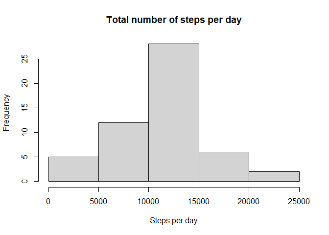
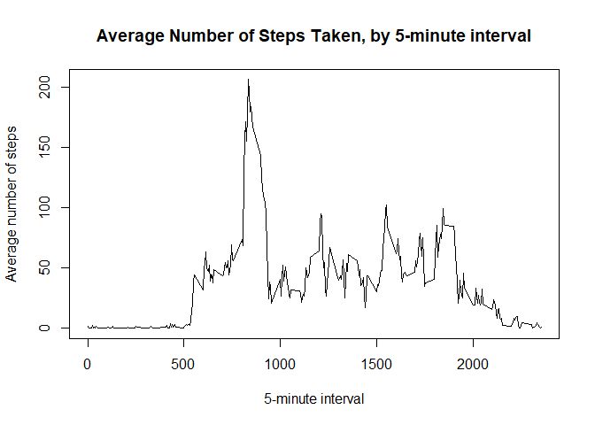
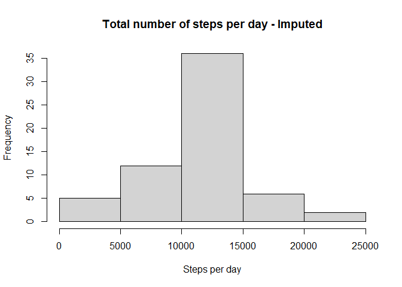
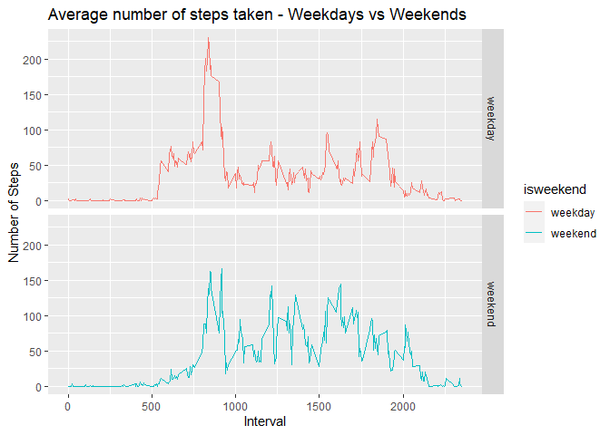

## Loading and preprocessing the data

```r
##Load packages needed
library(dplyr)
```

```
## 
## Attaching package: 'dplyr'
```

```
## The following objects are masked from 'package:stats':
## 
##     filter, lag
```

```
## The following objects are masked from 'package:base':
## 
##     intersect, setdiff, setequal, union
```

```r
library(ggplot2)

##If not present, then download data
fileUrl <- "https://d396qusza40orc.cloudfront.net/repdata%2Fdata%2Factivity.zip"
if (!file.exists("activity.zip")) {
    download.file(fileUrl,destfile = "activity.zip")
}
##If csv file not present, then unzip data
if (!file.exists("activity.csv")) {
    unzip("activity.zip")
}
## Read the data
actividad <- read.csv("activity.csv")

## Transform the variable date so it is in date format
actividad$date <- as.Date(actividad$date)
```


## What is mean total number of steps taken per day?

## For this part of the assignment, missing values in the dataset are ignored.


```r
## Calculate the total number of steps taken per day
StepsByDay <- aggregate(steps ~ date, actividad, sum)

## Make a histogram of the total number of steps taken each day
hist(StepsByDay$steps, main = "Total number of steps per day", xlab = "Steps per day" )
```

<!-- -->

```r
## 2. Calculate and report the **mean** and **median** total number of steps taken per day

print(paste("Mean of total number of steps taken per day:",round(mean(StepsByDay$steps))))
```

```
## [1] "Mean of total number of steps taken per day: 10766"
```

```r
print(paste("Median of total number of steps taken per day:",median(StepsByDay$steps)))
```

```
## [1] "Median of total number of steps taken per day: 10765"
```


## What is the average daily activity pattern?

### A time series plot of the 5-minute interval (x-axis) and the average number of steps taken, averaged across all days (y-axis) is constructed


```r
StepsByInterval <- aggregate(steps ~ interval, actividad, mean)
with(StepsByInterval,plot(interval,steps,type='l', main = "Average Number of Steps Taken, by 5-minute interval", xlab = "5-minute interval", ylab = "Average number of steps"))
```

<!-- -->

### Which 5-minute interval, on average across all the days in the dataset, contains the maximum number of steps?

```r
maxInterval <- StepsByInterval[which.max(StepsByInterval$steps),]    
print(paste("The interval with the maximum number of steps is:",maxInterval$interval,"with",round(maxInterval$steps,2),"steps."))
```

```
## [1] "The interval with the maximum number of steps is: 835 with 206.17 steps."
```

## Imputing missing values

### Calculate and report the total number of missing values in the dataset 


```r
print(paste("Total number of missing values in the dataset:",summary(actividad$steps)[7]))
```

```
## [1] "Total number of missing values in the dataset: 2304"
```

### The chosen strategy for filling in all of the missing values in the dataset is using the mean for the corresponding 5-minute interval


```r
for (i in 1:nrow(actividad)) {
    if (is.na(actividad$steps[i])) {
        fillValue <- StepsByInterval$steps[which(StepsByInterval$interval == actividad$interval[i])]
        actividad$steps[i] <- fillValue
        
    }
} 
```

### Make a histogram of the total number of steps taken each day 


```r
## Calculate the total number of steps taken per day
StepsByDayImputed <- aggregate(steps ~ date, actividad, sum)

## Make a histogram of the total number of steps taken each day
hist(StepsByDayImputed$steps, main = "Total number of steps per day - Imputed", xlab = "Steps per day") 
```

<!-- -->

### Calculate mean and median values and compare. Do these values differ from the estimates from the first part of the assignment? What is the impact of imputing missing data on the estimates of the total daily number of steps?


```r
print(paste("Mean of total number of steps taken per day - Imputed:",round(mean(StepsByDayImputed$steps))))
```

```
## [1] "Mean of total number of steps taken per day - Imputed: 10766"
```

```r
print(paste("Median of total number of steps taken per day - Imputed:",round(median(StepsByDayImputed$steps))))
```

```
## [1] "Median of total number of steps taken per day - Imputed: 10766"
```

```r
print("There is no apparent change in mean and median values after imputing NAs. There seems to be no impact on the total of daily number of steps.")
```

```
## [1] "There is no apparent change in mean and median values after imputing NAs. There seems to be no impact on the total of daily number of steps."
```


## Are there differences in activity patterns between weekdays and weekends?

### Create a new factor variable in the dataset with two levels -- "weekday" and "weekend" indicating whether a given date is a weekday or weekend day.


```r
actividad$isweekend <- as.factor(ifelse(format(as.Date(actividad$date),"%w") %in% c("6","0"),"weekend","weekday"))
```

### Make a panel plot containing a time series plot of the 5-minute interval (x-axis) and the average number of steps taken, averaged across all weekday days or weekend days (y-axis).


```r
## Summarize data by isweekend
StepsByInterval <- actividad %>% 
    select(steps,interval,isweekend) %>% 
    group_by(isweekend,interval) %>%     
    summarize(steps=mean(steps))
```

```
## `summarise()` regrouping output by 'isweekend' (override with `.groups` argument)
```

```r
## Create the plot on screen
g <- ggplot(StepsByInterval, aes(interval, steps, colour = isweekend)) 
g <- g + geom_line() + facet_grid(rows=vars(isweekend)) + labs(x="Interval", y="Number of Steps", title="Average number of steps taken - Weekdays vs Weekends") 
##+ theme(axis.text.x = element_text(angle = 90))
print(g)
```

<!-- -->

```r
print("There seem to be no significant difference between weekdays and weekends activity patterns other than an earlier start on weekdays, and a slightly greater activity on weekend midday hours.")
```

```
## [1] "There seem to be no significant difference between weekdays and weekends activity patterns other than an earlier start on weekdays, and a slightly greater activity on weekend midday hours."
```
